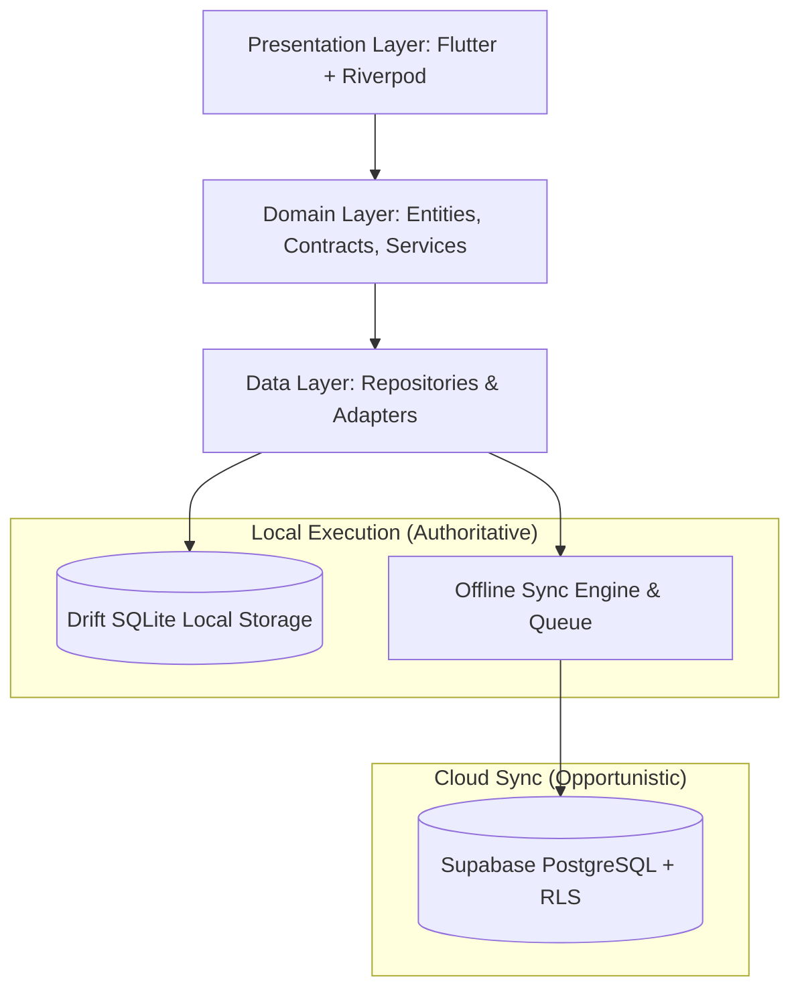

# FidelLearn (ፊደል ለርን) — Comprehensive Application Review & Technical Roadmap

> **Document Version:** 1.0.0  
> **Status:** Feature Complete for Phase 0–5 Offline Core  
> **Scope:** Architecture, Implemented Subsystems, Functional Specifications, Design System, Test Coverage, and Planned Roadmap.

---

## 1. Executive Summary & Core Philosophy

**FidelLearn** is an offline-first Ethiopian national exam preparation platform engineered specifically for secondary students (Grades 6, 8, and 12, with the initial rollout focused on Grade 12 Natural & Social Science streams).

The platform addresses the reality of digital education in Ethiopia: intermittent internet connectivity, high mobile data costs, power disruptions, and the critical need for verified, reliable national exam practice (ESSLCE).

### Core Architectural Tenets
1. **100% Offline-First Resilience**: All core student workflows—taking timed/untimed exams, browsing packages, viewing verified step-by-step explanations, saving bookmarks, managing the mistake notebook, and competing against their personal best with **Exam Ghost**—operate completely without an active network connection.
2. **Deterministic & Static Pedagogical Core (Zero AI Hallucination)**: Student-facing practice uses **100% educator-verified static question packages**. There is zero generative AI in student exams to prevent hallucinations, incorrect answers, or misleading scientific explanations.
3. **Cryptographically Verifiable Append-Only Study Coin Ledger**: Study Coins are never stored as mutable numbers. Balances are derived from an append-only ledger with unique UUIDs and idempotent transaction keys, guarding against double-spending and overdrafts.
4. **Bilingual by Design**: Full first-class interface and typography support for **English** and **Amharic (አማርኛ)**.
5. **Dual-Mode Repository Architecture**: Every repository implements an abstract contract with seamless fallback between a local Drift (SQLite) database and remote Supabase (PostgreSQL) synchronization.

---

## 2. System Architecture & Technical Stack



### Technology Stack
- **Framework**: Flutter 3.29.x / Dart 3.7.x (Strict null safety).
- **State Management**: Flutter Riverpod 2.6.x (AsyncNotifier, StateNotifier, unidirectional data flow).
- **Navigation & Routing**: GoRouter 13.x with route guards and query parameter parsing.
- **Local Persistence**: Drift 2.34.x (SQLite ORM) with custom DAOs and type converters.
- **Preferences & Secure Storage**: `SharedPreferences` (theme, locale) + `flutter_secure_storage` (auth tokens).
- **Remote Backend**: Supabase (PostgreSQL 15+, Row Level Security, Storage, Edge Functions).
- **Design System**: Custom Material 3 Ethiopian Emerald & Gold palette with Cosmic Dark & Lavender Light themes.

---

## 3. Comprehensive Feature & Function Breakdown

### 3.1 Onboarding, Language & Stream Selection
- **Splash Screen** (`/`): Checks existing authentication sessions and routing state; routes automatically to `/home` or `/onboarding`.
- **Language Switcher**: Instant switching between English and Amharic (`intl_en.arb`, `intl_am.arb`) with persistent state.
- **Grade & Stream Selection**:
  - Grade levels: Grade 6, Grade 8, and Grade 12.
  - Grade 12 Streams: **Natural Science** (Physics, Chemistry, Biology, Mathematics) and **Social Science** (History, Geography, Economics, Mathematics).
- **Guest / Zero-Account Mode**: Allows students to jump immediately into exam practice without mandatory upfront registration.

### 3.2 Authentication & Identity Management
- **Phone Number Authentication**: Primary authentication via phone number + password tailored for Ethiopian mobile users.
- **Role-Based Access Control (RBAC)**:
  - `student`: Standard access to exam practice, coin rewards, mistakes notebook, progress.
  - `teacher`: Access to classroom management, assignment creation, student roster analytics.
  - `school_admin`: Access to school-wide metrics, teacher rosters, class comparisons.
  - `platform_admin`: Access to content CMS, question verification workflows, audit trails.
- **Session Persistence**: Secure token storage with mock fallback when Supabase is not configured.

### 3.3 Student Home Dashboard
- **Streak Tracker**: Tracks daily active practice days with motivational streak badges.
- **Study Coin Balance Widget**: Live balance calculated directly from the immutable ledger.
- **Quick Practice Action**: One-tap resume for in-progress attempts or quick test launches.
- **Subject Progress Overview**: Visual cards indicating completion rate, download status, and topic masteries.

### 3.4 Subjects Hub & Offline Package Manager
- **Subject Browser**: Displays all enrolled curriculum subjects with official national exam booklet counts.
- **Offline Package Downloader**:
  - Simulates or executes compressed `.flpkg` package downloads.
  - Incremental delta package updates (`DeltaPackageService`).
  - Storage footprint management: inspect and free cached exam packages.
- **National Exam Booklet Metadata**: Shows official booklet identifiers (e.g., *Booklet 12*, *100 Questions*, *ESSLCE 2013 E.C.*).

### 3.5 Exam Builder & Custom Practice Engine
- **Custom Exam Configuration**:
  - Select Subject, Units, and specific Examination Years (e.g. 2013, 2014, 2015, 2016 E.C.).
  - Select question count (10, 25, 50, or full 100-question national booklet).
  - Mode selection: **Timed Mock Exam** vs. **Untimed Practice**.
  - Feedback mode: **Standard Exam Mode** (results at end) vs. **Immediate Feedback Mode** (answers shown per question).
- **Official Briefing Dialog**: Displays exam instructions, duration, negative-marking rules, and feedback options prior to launch.

### 3.6 Active Exam Runner (Redesigned Question Experience)
- **Simplified Header**:
  - Left: Back arrow with modal exit/pause guard + rounded timer capsule (`⏱ 119:51`).
  - Right: Bookmark/Flag toggle (`Icons.flag_outlined`), Question Palette grid launcher (`Icons.grid_view_rounded`), and filled purple **"Finish Exam"** button.
  - Integrated 2.5px linear progress line indicating percentage of questions answered.
- **Question Statement Card**:
  - Metadata badges: Difficulty pill (`DIFFICULTY: EASY`, `MEDIUM`, `HARD`) and source pill (`ESSLCE 2013 E.C.`).
  - Clear, prominent question statement with diagram support.
  - Instruction label: *"Select the single best answer:"*.
- **Tactile Option Cards (`FidelOptionCard`)**:
  - Vertical list of rounded rectangular cards.
  - Vertically centered circular letter badges (A, B, C, D) alongside option text.
  - Clear visual selection states (subtle lavender fill, high-contrast borders).
- **Interactive Working Footer**:
  - Left: **"Previous"** button (disabled on first question).
  - Center: `${_currentIndex + 1}/${totalQuestions}` counter. **Tapping opens a bottom-sheet Question Navigator** to jump to any question.
  - Right: **"Next Question"** button (or "Finish Exam" on last question).
- **State Protection**:
  - Automatic local SQLite autosave on every selection.
  - `PopScope` exit protection with confirmation dialog to prevent accidental exam abandonment.

### 3.7 Exam Results & Solution Review
- **Score Breakdown**: Overall percentage score, total correct/incorrect/unanswered count, time elapsed, and pass/fail indicator.
- **Topic Accuracy Radar**: Breakdown of mastery across individual curriculum units.
- **Step-by-Step Verified Explanations**:
  - Detailed rationale explaining why the correct choice is valid.
  - Analysis of distractors (why incorrect options are wrong).
  - **Key Concept** and **Common Pitfall** pedagogical notes.
- **Question Reporting**: In-app feedback dialog allowing students to flag typographical or factual errors for administrative review.

### 3.8 Mistake Notebook & Mastery Workflow
- **Automatic Mistake Capture**: Questions answered incorrectly during any exam attempt are automatically recorded into the Mistake Notebook.
- **Mastery Tracker**: Categorizes mistakes into *Needs Review* vs. *Mastered* based on subsequent retry attempts.
- **Targeted Retry Flow**: Launch practice sessions consisting exclusively of past mistakes until mastery is achieved.

### 3.9 Offline Bookmarks System
- **One-Tap Flagging**: Students can flag questions during live exams or solution reviews.
- **Offline Persistence**: Bookmarks are stored in local Drift SQLite and synced to Supabase when connected.
- **Filtered Review**: Filter bookmarked questions by subject, year, or difficulty.

### 3.10 Progress Analytics, Weak-Topic Detection & Readiness
- **Readiness Score Formula (0–100)**:
  - Mathematically combines three weighted factors:
    1. Overall accuracy (50% weight).
    2. Curriculum coverage percentage (30% weight).
    3. Consistency of recent attempts (20% weight).
- **Weak-Topic Detector**:
  - Automatically identifies curriculum topics with accuracy < 60% (provided a minimum attempt threshold of 3 questions is met).
  - Protects against premature flagging on small sample sizes.
- **Historical Performance**: Trend line visualization tracking score progression over time.

### 3.11 Gamification: Study Coin Append-Only Ledger & Rewards
- **Immutable Ledger**:
  - Every coin event is a distinct transaction with: `id`, `student_id`, `amount`, `transaction_type` (`daily_streak`, `exam_completion`, `reward_redemption`), `idempotency_key`, and `created_at`.
  - Current balance is computed via `SELECT SUM(amount)`.
  - Prevents balance manipulation and race condition overdrafts (`InsufficientCoinsFailure`).
- **Reward Redemption**:
  - **Airtime Store**: Simulated airtime voucher redemption for Ethio Telecom and Safaricom Ethiopia.
  - Optional rewarded ad gateway outside exam sessions for bonus Study Coins.

### 3.12 Exam Ghost: Personal-Best Comparator
- **Ghost Comparison Engine**:
  - Compares the student's current exam run with their historical personal best.
  - Displays real-time and end-of-exam metrics: score delta (+/- %) and pacing velocity (seconds per question).
  - Replays pacing ghost benchmarks to train students for time pressure under national exam conditions.

### 3.13 Peer Challenges & Offline QR Service
- **Friend & Sponsored Challenges**: Create custom question sets and challenge peers.
- **Offline QR Challenge Protocol**:
  - Encodes exam parameters and question seed IDs into an offline QR code.
  - Peers can scan the QR code offline to take the exact same exam challenge without internet connectivity.

### 3.14 Offline P2P Sharing (Wi-Fi Direct / Local Share)
- **Local P2P Service**: Enables students in offline schools to share downloaded subject packages and Study Coins directly between devices using simulated local Wi-Fi Direct and QR handshakes.

### 3.15 Local Payments (Telebirr & CBE Birr)
- **Payment Gateway Simulation**:
  - Local checkout support for **Telebirr** and **Commercial Bank of Ethiopia (CBE Birr)**.
  - Verification code validation, receipt generation, and package unlock flow.
  - Full transaction ledger stored locally.

### 3.16 Teacher Portal & Classroom Tools
- **Classroom Management**: Create classrooms, manage student rosters, view student engagement.
- **Assignment Creator**: Curate custom test assignments from the national question bank and assign completion deadlines.
- **Class Analytics**: Aggregate accuracy reports, topic deficiency heatmaps across classes.

### 3.17 School Administrator Portal
- **School Dashboard**: High-level school performance, teacher rosters, grade comparisons, and batch data exports.

### 3.18 Platform Admin CMS & Content Verification
- **Question Editor**: Full WYSIWYG question authoring with options, explanations, key concepts, diagrams, and metadata.
- **Verification Workflow**: Enforces strict lifecycle states: `Draft` ➔ `In Review` ➔ `Verified` ➔ `Published`.
- **Audit Trails**: Logs all content modifications with actor UUID, timestamp, and modification diffs.

### 3.19 Design System & Theme Engine
- **Themes**:
  - **Lavender (Light)**: High-clarity, modern educational palette.
  - **Cosmic (Dark)**: Sleek, low-eye-strain OLED dark mode.
- **Persistence**: Theme choice persists across restarts and hard web reloads via `SharedPreferences`.
- **Responsive Layout**: Fluid scaling from compact mobile screens (360px) to desktop dashboards (1440px+).

---

## 4. Current Status vs. Planned Roadmap

| Phase / Feature | Current Status | Description & Deliverables |
| :--- | :---: | :--- |
| **Phase 0: Architecture & Foundation** | **COMPLETE** | Clean Architecture, Drift SQLite schema, Riverpod setup, Supabase RLS migrations. |
| **Phase 1: Student Offline Vertical Slice** | **COMPLETE** | Exam builder, runner, results, solutions, bookmarks, mistakes notebook, ghost comparator. |
| **Phase 2: Offline Sync & Queue** | **COMPLETE** | Drift sync queue, exponential backoff, connectivity detection, dual-mode repositories. |
| **Phase 3: Study Coin Ledger & Rewards** | **COMPLETE** | Immutable append-only ledger, daily streaks, airtime store, rewarded ad gateway. |
| **Phase 4: Teacher & School Portals** | **COMPLETE** | Classrooms, assignments, rosters, school-wide dashboards and analytics. |
| **Phase 5: Admin CMS & Content Verification** | **COMPLETE** | Question authoring, verification lifecycle (`published`), audit logs. |
| **Question Runner UI Redesign** | **COMPLETE** | Simplified header, timer pill, tactile option cards, interactive tap-to-jump footer counter. |
| **Cloud Supabase Live Production Deploy** | *PLANNED* | Deploy PostgreSQL schema & Edge Functions to live Supabase cluster. |
| **Native Android Wi-Fi Direct Protocol** | *PLANNED* | Replace local P2P simulation with native Android Nearby Connections / Wi-Fi Direct socket. |
| **Expanded Content Packages** | *PLANNED* | Digitize and publish Grade 6 & Grade 8 National Exam packages (Regional & Ministry). |
| **Live Classroom Competitions** | *PLANNED* | Real-time teacher-hosted multiplayer exam challenges via WebSockets. |
| **Push Notifications & Reminders** | *PLANNED* | Local notifications for daily streak reminders and national exam countdowns. |
| **Store Packaging & Release** | *PLANNED* | Android App Bundle (AAB), APK signing for Telegram/sideload distribution, Web PWA. |

---

## 5. Quality Assurance & Test Verification

The codebase maintains strict quality control and comprehensive automated test coverage:

- **Static Analysis**: `flutter analyze` runs clean with **0 issues found** across the entire repository.
- **Formatting**: Adheres strictly to standard Dart style guidelines (`dart format`).
- **Automated Test Suite**: **135 automated tests passing** across unit, widget, and repository layers:

```text
00:08 +135: All tests passed!
```

### Key Test Suites
1. `test/unit/exam_engine_test.dart`: Attempt state, scoring algorithms, percentage math, auto-save triggers.
2. `test/unit/weak_topic_service_test.dart`: Statistical threshold filtering and readiness formula validation.
3. `test/unit/coin_ledger_test.dart`: Append-only math, overdraft prevention, idempotency deduplication.
4. `test/unit/exam_ghost_test.dart`: Speed and score delta comparisons against historical personal bests.
5. `test/unit/payment_gateway_test.dart`: Telebirr/CBE confirmation code parsing, receipt generation, pass activation.
6. `test/unit/theme_persistence_test.dart`: Theme selection and SharedPreferences recovery on refresh.
7. `test/widget/exam_runner_screen_test.dart`: Header timer badge, palette icons, question counter, tap-to-jump picker.
8. `test/widget/student_journey_test.dart`: End-to-end student flow from splash to exam completion.

---

## 6. Developer & Operations Quick Reference

### Essential CLI Commands
```powershell
# Install dependencies
flutter pub get

# Run full test suite
flutter test

# Run static analysis
flutter analyze

# Run local web server on port 3000
npm run dev
# OR: flutter run -d web-server --web-port=3000 --web-hostname=localhost

# Run on Windows Desktop
npm run dev:windows
# OR: flutter run -d windows

# Run on Chrome
npm run dev:chrome
# OR: flutter run -d chrome

# Code generation (Drift, Freezed, Riverpod)
dart run build_runner build --delete-conflicting-outputs
```

### Key Configuration Files
- **App Routes**: [`lib/core/routing/app_router.dart`](file:///c:/Users/tamer/Documents/Fidel%20Learn/lib/core/routing/app_router.dart)
- **Central Providers**: [`lib/core/providers/app_providers.dart`](file:///c:/Users/tamer/Documents/Fidel%20Learn/lib/core/providers/app_providers.dart)
- **Local SQLite Database**: [`lib/core/database/app_database.dart`](file:///c:/Users/tamer/Documents/Fidel%20Learn/lib/core/database/app_database.dart)
- **Theme Tokens**: [`lib/core/theme/fidel_theme.dart`](file:///c:/Users/tamer/Documents/Fidel%20Learn/lib/core/theme/fidel_theme.dart)
- **Developer Guidelines**: [`AGENTS.md`](file:///c:/Users/tamer/Documents/Fidel%20Learn/AGENTS.md)
