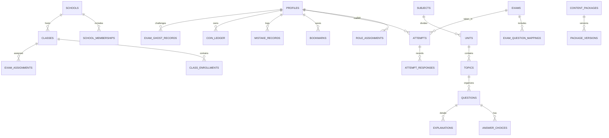

# FidelLearn Data Model Specification

## 1. Relational Entity Overview
The FidelLearn schema is designed to work symmetrically across **Supabase PostgreSQL** (cloud) and **Drift SQLite** (local mobile/desktop).

---

## 2. Core Entity Definitions

### 2.1 Profiles & Roles
- **`profiles`**: `id` (UUID, PK), `phone_number` (text, unique, encrypted/redacted in logs), `display_name` (text), `grade` (int), `stream` (text, optional: 'natural'/'social'), `preferred_language` (text: 'en'/'am'), `avatar_url` (text), `created_at` (timestamptz), `updated_at` (timestamptz), `deleted_at` (timestamptz, soft delete).
- **`roles`**: `id` (text, PK: 'student', 'teacher', 'school_admin', 'platform_admin'), `description` (text).
- **`user_roles`**: `user_id` (UUID, FK), `role_id` (text, FK), `granted_at` (timestamptz), `granted_by` (UUID).

### 2.2 Educational Hierarchy & Question Bank
- **`subjects`**: `id` (text, PK: e.g. 'math_g12', 'aptitude_g12'), `code` (text), `name_en` (text), `name_am` (text), `grade` (int), `stream` (text, optional), `icon_asset` (text), `sort_order` (int).
- **`units`**: `id` (text, PK), `subject_id` (text, FK), `unit_number` (int), `title_en` (text), `title_am` (text).
- **`topics`**: `id` (text, PK), `unit_id` (text, FK), `topic_number` (int), `title_en` (text), `title_am` (text).
- **`questions`**:
  - `id` (UUID, PK)
  - `grade` (int: 6, 8, 12)
  - `stream` (text: 'natural' | 'social' | 'common')
  - `subject_id` (text, FK)
  - `unit_id` (text, FK)
  - `topic_id` (text, FK)
  - `exam_year` (int, optional: e.g. 2015 E.C. / 2023 G.C.)
  - `question_text_en` (text)
  - `question_text_am` (text, optional)
  - `diagram_url` / `diagram_asset` (text, optional)
  - `difficulty` (text: 'easy' | 'medium' | 'hard')
  - `verification_status` (text: 'draft' | 'review_required' | 'approved' | 'published' | 'corrected' | 'archived')
  - `source_name` (text: 'FidelLearn original demonstration content' / future licensed attribution)
  - `source_page` (int, optional)
  - `content_version` (int, default 1)
  - `package_id` (text, optional)
  - `created_at`, `updated_at` (timestamptz)
- **`answer_choices`**: `id` (UUID, PK), `question_id` (UUID, FK), `choice_label` (text: 'A', 'B', 'C', 'D', 'E'), `choice_text_en` (text), `choice_text_am` (text, optional), `is_correct` (boolean), `sort_order` (int).
- **`explanations`**: `id` (UUID, PK), `question_id` (UUID, FK, unique), `solution_text_en` (text), `solution_text_am` (text, optional), `simpler_explanation_en` (text), `key_concept_or_formula` (text), `distractor_rationales` (jsonb / text), `common_pitfall` (text).

### 2.3 Exams, Attempts & Responses
- **`exams`**: `id` (UUID, PK), `title` (text), `exam_type` (text: 'practice', 'unit_test', 'mock_full', 'custom_builder', 'teacher_assigned'), `grade` (int), `stream` (text), `subject_id` (text, FK), `time_limit_minutes` (int, 0 for untimed), `total_questions` (int), `created_by` (UUID), `created_at` (timestamptz).
- **`exam_questions`**: `exam_id` (UUID, FK), `question_id` (UUID, FK), `order_index` (int), PK(exam_id, question_id).
- **`attempts`**:
  - `id` (UUID, PK)
  - `user_id` (UUID, FK)
  - `exam_id` (UUID, FK)
  - `start_time` (timestamptz)
  - `end_time` (timestamptz)
  - `duration_seconds` (int)
  - `total_questions` (int)
  - `score` (int)
  - `percentage` (numeric)
  - `correct_count` (int)
  - `incorrect_count` (int)
  - `skipped_count` (int)
  - `is_completed` (boolean)
  - `sync_status` (text: 'synced' | 'pending' | 'failed')
  - `created_at` (timestamptz)
- **`attempt_responses`**: `id` (UUID, PK), `attempt_id` (UUID, FK), `question_id` (UUID, FK), `selected_choice_id` (UUID, optional), `is_correct` (boolean), `time_spent_seconds` (int), `is_flagged` (boolean), `answered_at` (timestamptz).

### 2.4 Bookmarks, Mistakes & Ghost Challenges
- **`bookmarks`**: `id` (UUID, PK), `user_id` (UUID, FK), `question_id` (UUID, FK), `subject_id` (text), `topic_id` (text), `created_at` (timestamptz), `is_active` (boolean).
- **`mistake_records`**: `id` (UUID, PK), `user_id` (UUID, FK), `question_id` (UUID, FK), `mistake_count` (int), `is_mastered` (boolean), `last_failed_at` (timestamptz), `mastered_at` (timestamptz).
- **`exam_ghost_records`**: `id` (UUID, PK), `user_id` (UUID, FK), `exam_id` (UUID, FK), `best_score` (int), `best_duration_seconds` (int), `best_attempt_id` (UUID, FK), `attempt_count` (int), `updated_at` (timestamptz).

### 2.5 Study Coin Append-Only Ledger
- **`coin_ledger`**:
  - `id` (UUID, PK)
  - `user_id` (UUID, FK)
  - `transaction_type` (text: 'CREDIT' | 'DEBIT')
  - `amount` (int, strictly positive integer)
  - `reason` (text: 'daily_goal', 'streak_milestone', 'rewarded_ad', 'bonus_exam_unlock', 'ghost_retry_unlock', 'further_explanation')
  - `related_entity_id` (text, optional: attempt_id, ad_id, exam_id)
  - `idempotency_key` (text, unique constraint)
  - `created_at` (timestamptz)
  - `server_verified` (boolean)

---

## 3. Database Indexes for High-Speed Filtering
- `idx_questions_filter`: `(grade, stream, subject_id, unit_id, topic_id, verification_status)`
- `idx_attempts_user_exam`: `(user_id, exam_id, is_completed)`
- `idx_coin_ledger_idempotency`: `(user_id, idempotency_key)`
- `idx_bookmarks_user_active`: `(user_id, is_active)`
- `idx_mistakes_user_mastered`: `(user_id, is_mastered)`
