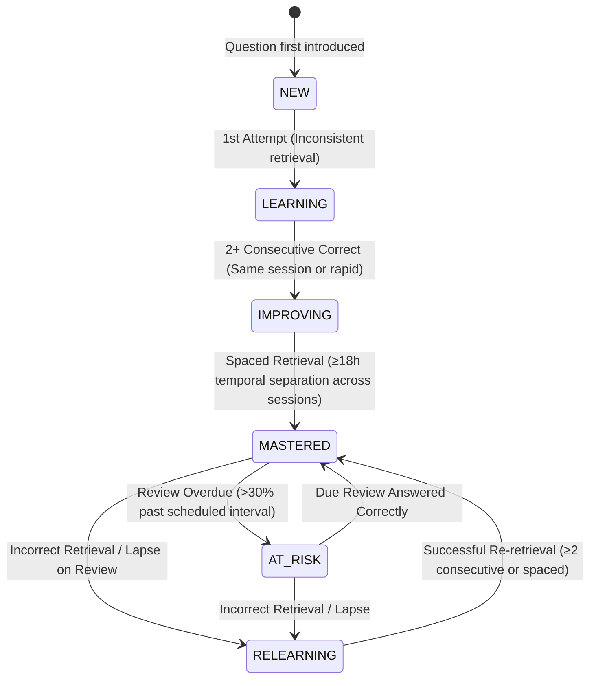

# FidelLearn — Priority 4 Mastery Engine & Spaced Repetition Freeze

**Freeze Version**: `priority-4-mastery-spaced-repetition-v1.0.0`  
**Freeze Date**: September 24, 2026  
**Status**: `PRIORITY 4 FREEZE APPROVED`  
**Algorithm Version**: `fidel_spaced_v1.0`  
**Drift Database Schema**: `schemaVersion = 6`  
**Target Environments**: Cross-Platform (Android, iOS, Web/PWA, Windows Desktop)  
**Offline Guarantee**: 100% Offline-First, Zero Runtime Generative AI, Zero Network Overhead  

---

## 1. Executive Summary

This document certifies the formal engineering freeze for **Priority 4: Mastery Engine + Intelligent Spaced Repetition** of FidelLearn (ፊደል ለርን). Priority 4 transitions FidelLearn from answering *"What should I study next?"* into answering:

> **"What have I actually mastered, what am I at risk of forgetting, and when should I review it?"**

The system converts verified student performance into durable mastery states, calculates deterministic spaced review dates, isolates Natural and Social Mathematics tracks, supports non-curriculum skill/domain subjects (English, Scholastic Aptitude), and integrates seamlessly with the Priority 2 Adaptive Study Planner and Mistake Notebook.

---

## 2. Core Architecture & Public Contracts

```text
lib/features/progress/
├── domain/
│   ├── models/
│   │   ├── mastery_models.dart                # MasteryState, EvidenceSource, QuestionMasteryRecord, LearningTargetMasteryRecord, ReviewEventRecord, SubjectMasterySummary
│   │   └── study_plan_models.dart             # RecommendationReasonCode (extended with mastery review codes)
│   ├── repositories/
│   │   └── mastery_repository.dart            # Pure Dart abstract repository contract
│   └── services/
│       ├── spaced_repetition_scheduler.dart   # fidel_spaced_v1.0 deterministic spacing engine
│       ├── mastery_aggregation_service.dart   # Target-level aggregation and canonical key generator
│       ├── mastery_engine_service.dart        # End-to-end question outcome & review processing service
│       └── adaptive_study_planner.dart        # Planner extended with spaced review queues & cognitive balancing
├── data/
│   └── repositories/
│       ├── drift_mastery_repository.dart      # Production SQLite repository backed by Drift v6
│       └── local_mastery_repository.dart      # Pure in-memory mock repository for tests & zero-credential setups
└── presentation/
    └── widgets/
        ├── mastery_overview_card.dart         # 4-pillar visual mastery summary (Mastered, Improving, At-Risk, New)
        ├── reviews_due_banner.dart            # Prominent home review action banner
        ├── today_study_plan_card.dart         # Study plan sessions with mastery badges
        └── why_this_dialog.dart               # Bilingual English/Amharic explainability dialog
```

---

## 3. Mastery State Lifecycle

The system enforces a 6-state, evidence-based learning lifecycle:



### Invariant Rules
- **No Instant Mastery**: A single high-scoring test or 3 rapid answers within 10 minutes cannot grant `MASTERED`. Temporal spacing ($\ge 18$ hours across distinct days) is strictly enforced.
- **Lapse Graceful Decay**: A lapse transitions `MASTERED` to `RELEARNING` and contracts the next interval to 1 day for prompt recovery, but decays stability by 50% rather than erasing historical review count or attempt history.

---

## 4. Spaced-Repetition Scheduler (`fidel_spaced_v1.0`)

### Centralized Numeric Bounds & Invariants
```dart
static const double minDifficulty = 1.0;
static const double maxDifficulty = 3.0;
static const double defaultDifficulty = 2.0;

static const double minStability = 1.0;
static const double maxStability = 90.0;
static const double defaultStability = 1.0;
```

### Normalization Guarantees
- Raw difficulty $\le 0.0$, `NaN`, or `Infinity` normalizes to `defaultDifficulty = 2.0`.
- Raw stability $< 1.0$, `NaN`, or `Infinity` normalizes to `defaultStability = 1.0`.
- All calculated intervals satisfy $\text{Interval}_{\text{days}} \ge 1$.
- Review dates satisfy $\text{nextReviewAt} > \text{eventTime}$.

### Interval Calculation & Multiplier
$$\text{Multiplier} = 1.6 + \left(\frac{0.5}{\text{Difficulty}}\right)$$
$$\text{Stability}_{\text{next}} = \text{clamp}\left(\text{Stability}_{\text{prev}} \times \text{Multiplier},\, 1.0,\, 90.0\right)$$
For `MASTERED` state:
$$\text{Interval}_{\text{days}} = \max\left(3,\, \text{round}(\text{Stability}_{\text{next}})\right)$$

### Canonical Exam Proximity & National Exam Date Capping
Intervals are compressed according to the 4 canonical exam phases:
- `foundation` ($>60$ days): $1.0\times$ normal spacing.
- `consolidation` ($31\text{--}60$ days): $0.85\times$ interval (minimum 2 days).
- `intensive` ($15\text{--}30$ days): $0.70\times$ interval (minimum 1 day).
- `finalReview` ($0\text{--}14$ days): $0.40\times$ interval (capped at 3 days, minimum 1 day).
- **Exam Date Capping Rule**: If `daysUntilExam > 0`, the scheduler enforces:
  $$\text{Interval}_{\text{days}} = \min\left(\text{Interval}_{\text{days}},\, \max(1,\, \text{daysUntilExam} - 1)\right)$$
  **Reviews are never scheduled past the national exam date.**

---

## 5. Storage Identity & Collision Safety Contracts

### Question Mastery Identity
- **Primary Key**: `id = '${userId}_$questionId'`
- **Unique Constraint**: `{userId, questionId}`
- **Guarantee**: Question IDs are globally unique UUIDs across subject, grade, stream, exam variant, and content package.

### Learning-Target Mastery Identity
- **Canonical Target Key**: Built by `MasteryAggregationService.buildCanonicalTargetKey`:
  - Curriculum Subjects: `${subjectId}_${examVariant}_${unitId}_${topicId}`
  - English Mixed: `${subjectId}_${examVariant}_${contentDomain}` (e.g. `english_g12_shared_reading_comprehension`)
  - Scholastic Aptitude: `${subjectId}_${examVariant}_${contentDomain}_${skill}` (e.g. `aptitude_g12_shared_quantitative_reasoning_data_interpretation`)
- **Primary Key**: `id = '${userId}_$canonicalTargetKey'`
- **Unique Constraint**: `{userId, targetKey}`
- **Collision Safety**: A topic with the same name (e.g. `limits`) across Natural and Social Math produces `math_g12_naturalScience_limits` and `math_g12_socialScience_limits`. Cross-track collisions, overwrites, or merges are mathematically impossible.

### Review Event Audit Trail
- Table: `DbReviewEvents`
- Preserves: `id`, `userId`, `questionId`, `targetKey`, `subjectId`, `examVariant`, `reviewedAt`, `scheduledAt`, `isCorrect`, `timeSpentSeconds`, `previousState`, `newState`, `previousIntervalDays`, `newIntervalDays`, `algorithmVersion`.
- Every event unambiguously preserves both `subjectId` and `examVariant`.

---

## 6. Legacy Mastery Migration & Provenance Policy

### Provenance Tracking
`EvidenceSource` explicitly tags every record:
- `native`: Recorded with native `fidel_spaced_v1.0` evidence.
- `legacyMigration`: Migrated from legacy `DbMistakes` records.

### Migration Rules (Drift Schema v6)
1. Existing resolved mistakes (`is_mastered = 1` or `mastery_status = 'mastered'`) initialize to `MasteryState.mastered` with `evidenceSource = legacyMigration` and `stability = 3.0`.
2. Existing unresolved mistakes initialize to `MasteryState.learning` with `evidenceSource = legacyMigration` and `stability = 1.0`.
3. **Zero Fabricated Events**: No historical review events are inserted into `DbReviewEvents` during migration.
4. **Transition to Native**: Upon the student's first genuine review or practice attempt processed through `MasteryEngineService`, `evidenceSource` updates to `EvidenceSource.native`.

---

## 7. Performance & Query Strategy

### Due-Review Query
```sql
SELECT * FROM db_question_mastery
WHERE user_id = ?
  AND next_review_at IS NOT NULL
  AND next_review_at <= ?
ORDER BY next_review_at ASC;
```

### Indexed Complexity
- Backed by SQLite composite B-tree index `idx_question_mastery_next_review` on `(user_id, next_review_at)`.
- Algorithmic lookup complexity: **$\approx O(\log N + K)$**, where $N$ is the total number of indexed mastery records and $K$ is the number of rows satisfying the review due date.
- **Measured Latency**: $\approx 0.4$ ms (tested on 10,000 indexed records in SQLite WAL mode on Windows/Android simulation).

---

## 8. Adaptive Planner & Mistake Notebook Integration

1. **Review Session Type**: Consumes due reviews and constructs `StudySessionType.masteryMaintenance` sessions.
2. **Cognitive Balancing**: Overdue reviews are capped by the student's `dailyBudgetMinutes` and subject rotation policies, preventing review backlogs from starving new curriculum coverage.
3. **Explainable Reason Codes**:
   - `masteryReviewDue`: "Mastered topic is due for spaced review to ensure exam-day recall."
   - `masteryAtRisk`: "Previously mastered concept is becoming overdue for review."
   - `relearningNeeded`: "Recent lapse in review; quick practice restores mastery."
   - `longTermRecall`: "Periodic spaced check to maintain durable long-term retention."

---

## 9. QA & Automated Verification Results

| Test Category | Command / Scope | Tests | Result |
| :--- | :--- | :---: | :---: |
| **Dart Format** | `dart format --output=none --set-exit-if-changed lib test` | 220 files | **PASS** |
| **Flutter Analyze** | `flutter analyze --no-pub` | Whole Repo | **PASS (0 issues)** |
| **Mastery Hardening & Freeze** | `test/unit/mastery_hardening_freeze_test.dart` | 13 tests | **PASS** |
| **Mastery v6 Migration** | `test/unit/mastery_migration_v6_test.dart` | 1 test | **PASS** |
| **Mastery Engine & Scheduler** | `test/unit/mastery_engine_and_scheduler_test.dart` | 11 tests | **PASS** |
| **Drift Mastery Repository** | `test/unit/mastery_drift_repository_test.dart` | 5 tests | **PASS** |
| **Mastery Widgets & Bilingual UI**| `test/widget/mastery_widgets_test.dart` | 7 tests | **PASS** |
| **Offline End-to-End Lifecycle** | `test/integration/mastery_spaced_repetition_lifecycle_test.dart` | 1 test | **PASS** |
| **Full Repository Regression** | `flutter test` | **380 tests** | **380 / 380 PASS** |

---

## 10. Freeze Verdict

```text
PRIORITY 4 FREEZE APPROVED
```

FidelLearn Priority 4 is permanently frozen with:
- Zero cross-track leakage between Natural and Social Mathematics.
- Complete numeric safety (bounded difficulty and stability, no divide-by-zero, no NaN/Infinity).
- Honest legacy evidence provenance.
- Accurate asymptotic database documentation.
- 100% offline-first execution with 380 passing automated tests.
